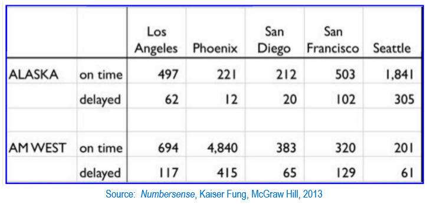

```{r setup, include=FALSE}
knitr::opts_chunk$set(echo = TRUE)
library(knitr)
library(tidyr)
library(dplyr)
library(ggplot2)
```




(1) Create a .CSV file (or optionally, a MySQL database!) that includes all of the information above.  You’re encouraged to use a “wide” structure similar to how the information appears above, so that you can practice tidying and transformations as described below.    
  
    
    **CSV File created using Microsft Excel. File can found in [Git Repository](https://raw.githubusercontent.com/kamathvk1982/Data607-Week05/master/ArrivalDelays.csv).**

--------------------------------------------------------------------------------

\clearpage  
  
(2) Read the information from your .CSV file into R, and use tidyr and dplyr as needed to tidy and transform your data.  
  
    ```{r, warning = FALSE}
    # Reading the CSV file from GIT repository and loading into dataframe:
    theUrl <- "https://raw.githubusercontent.com/kamathvk1982/Data607-Week05/master/ArrivalDelays.csv"
    ArrivalDelays.df <- read.csv(file = theUrl, header = T , sep = ','
                                 , na.strings=c("NA","NaN", "") )
    kable(ArrivalDelays.df)
    
    
    # Renaming the first two columns to meaningfull names:
    colnames(ArrivalDelays.df)[colnames(ArrivalDelays.df) 
                               %in% c("X", "X.1")] <- c("Airline", "Status")

    # Use the tidyr->drop_na function to drop the row on column Status having NA value
    ArrivalDelays.df <- drop_na(ArrivalDelays.df, Status)    
    kable(ArrivalDelays.df)

    # Use the tidyr->fill function to get Airline name on the row for the delayed data: 
    # fill() function, by defualt downward direction, helps to  fill NA value from recent
    # non-NA values
    ArrivalDelays.df <- fill(ArrivalDelays.df, Airline)
    kable(ArrivalDelays.df)
  
    
    # Above three steps have helped us to get the data in a format that helps to work 
    # with the final set of data and to work with it in a better way now.
    
    # Next, we will tidy the data by reshaping the data layput in the table by using 
    # tidyr->gather function to move the airport column names into a key column, 
    # gathering the column values into a single value column.
    
    # We will create two dataset for Ontime and Delayed information and lter merge them 
    # to form a single final dataset
    
    OnTime.ArrivalDelays.df <- ArrivalDelays.df %>%
      filter(Status == 'on time')  %>%
      gather( `Los.Angeles`,`Pheonix`,`San.Diego`,
               `San.Francisco`,`Seattle`,key = "Airport", value = "On.Time") %>%
      select( Airline, Airport, On.Time) %>%
      arrange(Airline, Airport)
    
    kable(OnTime.ArrivalDelays.df)

    delayed.ArrivalDelays.df <- ArrivalDelays.df %>%
      filter(Status == 'delayed')  %>%
      gather( `Los.Angeles`,`Pheonix`,`San.Diego`,
               `San.Francisco`,`Seattle`,key = "Airport", value = "Delayed") %>%
      select( Airline, Airport, Delayed) %>%
      arrange(Airline, Airport)
    
    kable(delayed.ArrivalDelays.df)
    
    # We will now merge the above two dataset to one fianl dataset based on common keys
    # Airline and Airport; we wiil use dplyr->full_join
    
    final.ArrivalDelays.df <- full_join(OnTime.ArrivalDelays.df, delayed.ArrivalDelays.df
                                        ,by =  c("Airline", "Airport"), copy=FALSE) 
    
    # We will add / dplyr->mutate a new column to get the percent of dealyed against total flights
    # an airline does at an airport
    
    final.ArrivalDelays.df$On.Time  <- as.double(sub(',','',final.ArrivalDelays.df$On.Time))
    final.ArrivalDelays.df$Delayed  <- as.double(sub(',','',final.ArrivalDelays.df$Delayed))
    
    final.ArrivalDelays.df <- mutate(final.ArrivalDelays.df, Percent.Delayed = round((Delayed/ 
                                         (On.Time+Delayed) )*100, 2) )
    
    # Final Transformed Data ; Ready for further analysis!:
    kable(final.ArrivalDelays.df)

    
    ```  

--------------------------------------------------------------------------------

\clearpage  
  
(3) Perform analysis to compare the arrival delays for the two airlines.  
  
    ```{r}
    # 1. We can get the Mean and Standard Deviation for each airline:
    final.ArrivalDelays.df %>%
      group_by(Airline) %>%
        summarise(Mean=mean(Percent.Delayed), SD=sd(Percent.Delayed))
    
    # Plotting the boxplot to check on the outliers:
    ggplot(final.ArrivalDelays.df, aes(x=Airline, y=Percent.Delayed , color=Airline)) + 
      geom_boxplot()
    ```
    
    ***-> Based on above, we can say AM WEST on average is more delayed then Alaska Airlines.***
    
    
    
    ```{r}
    # 2. Airport wise we can check the Top Delayed Airline:
    final.ArrivalDelays.df %>%
      group_by(Airport) %>% 
      top_n(1, Percent.Delayed)
    
    # Plotting the line plot to check on same:
    ggplot(final.ArrivalDelays.df, aes(x = Airport, y = Percent.Delayed, group = Airline,color 
                                       = Airline,shape=Airline) ,xlab = "Airport" , ylab = "Percent.Delayed") +
      geom_line() + geom_point((aes(shape=Airline)))

    ```  

    ***-> Based on above, we can say AM WEST had highest delayed for each airport as well.***

--------------------------------------------------------------------------------

\clearpage  
  
